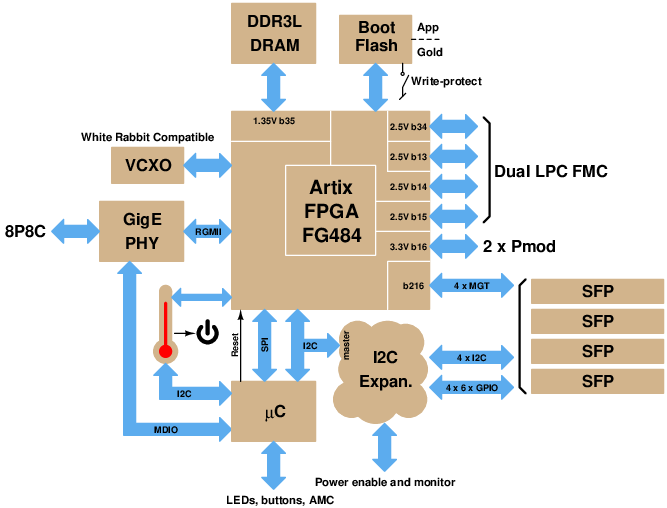
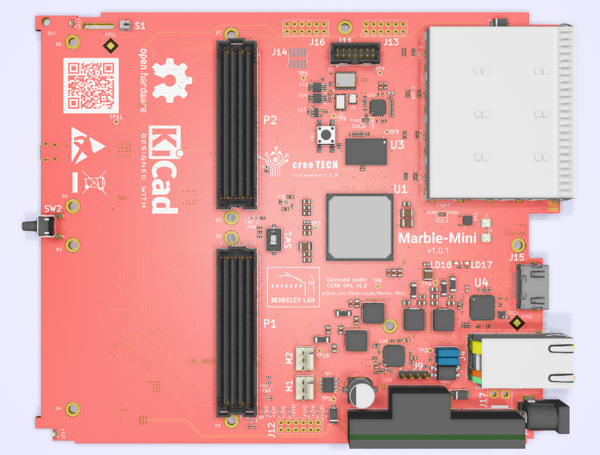

# Marble-Mini board

Marble-mini is a Dual FMC (LPC) AMC FPGA carrier with a Xilinx Artix-7 FPGA. It's a general purpose carrier board, sized to satisfy needs of some BPM and LLRF applications.
It includes features relevant for deployment to unattended sites (e.g., accelerator service galleries), as well as for general development and testing.

This design is the result of a collaboration between [LBNL](https://www.lbl.gov/) and [CreoTECH](http://creotech.pl/en/home/).

## Original concept:

## [Specifications](docs/specs.md)

## (Almost) Reality:

## Configuration

At assembly time this design can be configured either as a Network Attached Device (NAD, sometimes called Pizza Box) or as an AMC (mTCA) card.  Skilled rework could convert one to the other.

In NAD configuration, the four GTP ports of the FPGA are connected to
SFP slots, and Ethernet is brought out on a usual 8P8C "RJ45" connector.
In AMC configuration, the four GTP ports of the FPGA are connected to PCIe
lanes of the AMC backplane, and Ethernet is also connected to the backplane.
Configuration of the GTP port routing is accomplished with placement of
0201 (0603 Metric) coupling capacitors.

## Tools

The schematic/layout tool used is [KiCad EDA](http://www.kicad-pcb.org/)
version 5.1.2 or later in the 5.1.x series.
Other versions will very likely either not read the files
in this repo, or will save files that are not compatible with
collaborators' reference installations.
We also make use of [KiBoM](https://github.com/SchrodingersGat/KiBoM).

Note: Electrical Rules Checker reports 10 errors and 11 warnings. All of them are caused by errors in the library models. In order to remove them, the corresponding ERC settings should be deactivated (for errors: Output pin <-> Output pin, Power output pin <-> Power output pin, Power output pin <-> Output pin, Open collector <-> Output pin, and for warnings: Power output pin <-> Bidirectional pin).

## Major Parts

* U1: Xilinx [XC7A100T-2FGG484](https://www.xilinx.com/products/silicon-devices/fpga/artix-7.html) FPGA (see note)
* U2: NXP [LPC1776FET180](https://www.nxp.com/products/processors-and-microcontrollers/arm-based-processors-and-mcus/lpc-cortex-m-mcus/lpc1700-cortex-m3:MC_1403790745385#/) Microcontroller
* U3: Micron [MT41K512M16HA](https://www.micron.com/products/dram/ddr3-sdram/part-catalog/mt41k512m16ha-125) or similar DDR3 x16 memory up to 8Gb
* U4: Marvell [88E1512](https://www.marvell.com/documents/eoxwrbluvwybgxvagkkf/) Ethernet PHY
* U20: TI [CDCM61004](http://www.ti.com/product/CDCM61004) Clock Generator
* U23: FTDI [FT4232H-56Q](https://www.ftdichip.com/Products/ICs/FT4232H.htm) USB interface
* U30: Cypress [S25FL128S](https://www.cypress.com/documentation/datasheets/s25fl128ss25fl256s-128-mb-16-mb256-mb-32-mb-30v-spi-flash-memory) Flash Memory
* U35: Maxlinear [XRP7724](https://www.maxlinear.com/product/power-management/universal-pmics/universal-pmics/xrp7724) Quad PWM Power Controller
* Y2: Mercury [VM53S3-25.000](https://docs-apac.rs-online.com/webdocs/151c/0900766b8151cb85.pdf) 25 MHz VCTCXO

Note: U1 is compatible with XC7A35T through XC7A200T; need XC7A75T or larger
to get all User I/O of dual-LPC-FMC

## Auxiliary documentation

25-page schematics like this are a modern reality, but that doesn't mean they are easy to navigate.
To aid in understanding subsystems that are splattered over multiple sheets, here are
block diagrams that can act as introductions or indexes to the actual machine-readable
and DRC'd schematics.

* I2C subsystems: [marble_i2.eps](docs/marble_i2c.eps)
* Power Routing: [mm_power.eps](docs/mm_power.eps)

These are EPS files, authored using xcircuit.
Maybe you want to use GhostView to look at them.

## Scripting and processing

See the [scripts subdirectory](scripts/README.md) for
instructions and helper scripts covering:

* Updating the I2C subsystem diagram in schematics
* Inserting QR code on silkcsreen
* Generating artifacts for manufacturing
* Generating Xilinx constraint file

## Copyright

Marble Copyright (c) 2019, The Regents of the University of California, through Lawrence Berkeley National Laboratory (subject to receipt of any required approvals from the U.S. Department of Energy). All rights reserved.

This documentation describes Marble and is licensed under the CERN OHL v. 1.2.

NOTICE. This documentation was developed under funding from the U.S. Department of Energy and the U.S. Government consequently retains certain rights. As such, the U.S. Government has been granted for itself and others acting on its behalf a paid-up, nonexclusive, irrevocable, worldwide license in the documentation to reproduce, distribute copies to the public, prepare derivative works, and perform publicly and display publicly, and to permit others to do so.

You may redistribute and modify this documentation under the terms of the CERN OHL v.1.2. (http://ohwr.org/cernohl). THIS DOCUMENTATION IS PROVIDED BY THE COPYRIGHT HOLDERS AND CONTRIBUTORS "AS IS" AND ANY EXPRESS OR IMPLIED WARRANTIES, INCLUDING, BUT NOT LIMITED TO, THE IMPLIED WARRANTIES OF MERCHANTABILITY AND FITNESS FOR A PARTICULAR PURPOSE ARE DISCLAIMED. IN NO EVENT SHALL THE COPYRIGHT OWNER OR CONTRIBUTORS BE LIABLE FOR ANY DIRECT, INDIRECT, INCIDENTAL, SPECIAL, EXEMPLARY, OR CONSEQUENTIAL DAMAGES (INCLUDING, BUT NOT LIMITED TO, PROCUREMENT OF SUBSTITUTE GOODS OR SERVICES; LOSS OF USE, DATA, OR PROFITS; OR BUSINESS INTERRUPTION) HOWEVER CAUSED AND ON ANY THEORY OF LIABILITY, WHETHER IN CONTRACT, STRICT LIABILITY, OR TORT (INCLUDING NEGLIGENCE OR OTHERWISE) ARISING IN ANY WAY OUT OF THE USE OF THIS SOFTWARE, EVEN IF ADVISED OF THE POSSIBILITY OF SUCH DAMAGE. Please see the CERN OHL v.1.2 for applicable conditions.
