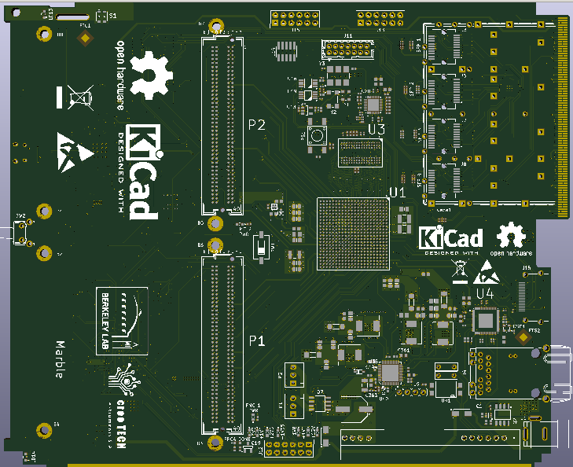

# Marble board

LBNL-Creotech collaboration: Dual FMC (LPC) NAD/AMC Carrier

A general purpose carrier board, sized to satisfy needs of some BPM and LLRF applications

## Original concept:

## [Specifications](specs.md)

## (Almost) Reality:

